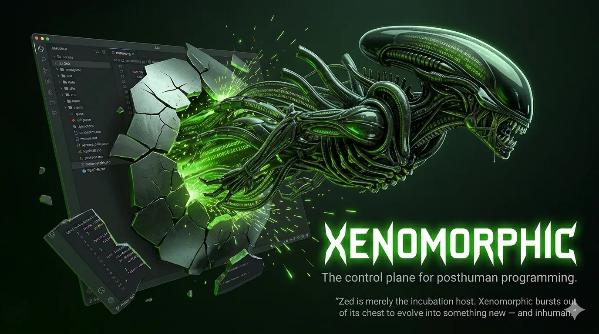

*The control plane for posthuman programming.*

> **⚠️ Hard fork of [Zed](https://github.com/zed-industries/zed)**
> Xenomorphic uses Zed as an incubation host, then bursts out of its chest
> to evolve into something new and inhuman. Not affiliated with Zed Industries, Inc.
> See [FORK_NOTICE.md](./FORK_NOTICE.md) for context.

---

## What is Xenomorphic?

A modern, high-performance `tmux` — deeply integrated with a world-class editor
and the most technically advanced coding agent ever built (powered by DeltaDB).

Zed gave us GPUI, DeltaDB, and an incredible editor core. Xenomorphic rips out
everything that isn't essential to the mission of being a *control plane for
posthuman programming* — where human and agent coding are first-class
co-inhabitants of the same environment.

## What's Being Ripped Out

- **Collaboration features** — tethered to Zed's proprietary Cloud services; dead weight
- **ACP (Agent Client Protocol)** — too limited, too buggy, distracts from making the built-in agent better
- **Rules library** — outdated compared to automatically summoned skills and memories
- **The agent sidebar horror show** — replaced with proper tabs in regular panes

## What's Being Built

Zed's built-in agent moves too slowly — they've got the excuse of ACP to lean on, so they don't ship the hard things themselves. Catching up to the meaningful, serious features of AMP (handoff), Crush (LSP tools), Claude Code (skills, hooks), and others isn't optional — it's the focus. If it helps you and an agent ship code together, it belongs here.

### Core Structural Changes
- **Agent panel → tab** — convert the agent panel into a regular tab that can be placed in any pane, rearranged, and kept open in multiples. No more locked-in custom panel.
- **Agent sidebar → project sidebar** — replace the agent sidebar with an optional sidebar for quick-switching projects
- **Bottom dock → regular panes** — terminal, debugger, etc. become tabs in panes. Xenomorphic is GUI tmux.
- **Cmd+Drag tabs** — relocate tabs without turning the tab bar on

### Agent Evolution
- **Skills + templated slash commands** — rip out rules, replace with a full implementation (with UI) of skills and OpenCode-compatible templated slash commands
- **Agent sessions stored as files** — exportable, readable, not locked in a sqlite db
- **Search project files opens agent sessions** — agent sessions are first-class searchable tabs you can place in any pane
- **Attach models and prompts to profiles** — choose profile per sub-agent
- **Respect global `AGENTS.md`** — project-level agent configuration that just works
- **Streaming edit calls** — finally, smaller token usage
- **Hooks** — pluggable agent lifecycle hooks

### Terminal & Shell
- **libghostty-vt** — replaces libalacritty; kitty image protocol support
- **Focus-follows-mouse for panes** — because you're a posthuman and your attention is parallel

### Editor & UX
- **File browser as a tab** — not just a sidebar panel, but a full file manager tab with a movable root not limited to a particular project. Advanced visual file manipulation without leaving Xenomorphic.
- **Editor settings as a tab** — settings are a document you can put in a pane
- **Org-mode support** — built-in, because structured thought deserves structured editing
- **Jujutsu (jj) support** — first-class VCS for the version control of the future
- **Webviews for documentation** — read docs in-place without leaving the control plane
- **Merge in PDF viewer** — https://github.com/Slipstream-Max/zed/tree/feature/pdf-viewer

### Extensibility
- **WASM extensions** — kept for compatibility
- **Lua extensions** — add commands to the palette that can run editor commands or open new panes with arbitrary GPUI UIs
- **No more walled garden** — if it can render in a pane, it belongs here

## Building from Source

- [Building for macOS](./docs/src/development/macos.md)
- [Building for Linux](./docs/src/development/linux.md)
- [Building for Windows](./docs/src/development/windows.md)

## Licensing

Xenomorphic is derived from [Zed](https://github.com/zed-industries/zed) by Zed Industries, Inc.,
used under the terms of the GNU Affero General Public License v3.0,
the Apache License 2.0, and the GNU General Public License v3.0.
See the `LICENSE-AGPL`, `LICENSE-APACHE`, and `LICENSE-GPL` files for details.

License information for third party dependencies must be correctly provided for CI to pass.
See `script/licenses/zed-licenses.toml` and the
[`cargo-about` book](https://embarkstudios.github.io/cargo-about/cli/generate/config.html#crate-configuration) for details.
